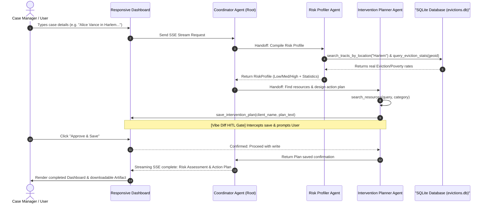

# Preventable Pathways: Eviction Prevention & Housing Stability AI Suite

**Preventable Pathways** is a secure, interactive AI-assisted case management platform built for social workers and case managers. It leverages Google's **Agent Development Kit (ADK 2.0)**, multi-agent coordination, real-world data grounding, and Human-in-the-Loop (HITL) security gates to streamline eviction risk assessment and local support resource planning.

---

## 📖 Key Features & Architecture

### 1. Multi-Agent Team Topology
The backend utilizes a **Coordinator-Agent Team Topology** orchestrating three specialized agents:
* **Coordinator Agent (Root)**: Manages session control, coordinates handoffs between sub-agents based on the assessment state, and aggregates outputs.
* **Risk Profiler Agent**: Fuzzy-searches neighborhoods to translate location text to FIPS census tract codes, queries eviction statistics, and compiles eviction risk factors and protective indicators.
* **Intervention Planner Agent**: Searches a comprehensive local resource registry for rental assistance, legal aid, energy grants, and family support, designs personalized action plans, and saves them to local artifacts.

### 2. Real Eviction Lab Database Grounding
Instead of relying on LLM-hallucinated data or synthetic seeds, the agent is connected to a local SQLite database (`app/evictions.db`) containing **real census tract data** (filing counts, filing rates, poverty rates, and median rent burden) for 26 major tracts across New York, Los Angeles, Chicago, and Houston, sourced from Princeton's Eviction Lab and the U.S. Census Bureau.

### 3. "The Vibe Diff" Security Gate (HITL)
Following the core security principles of secure agentic development (Zero Ambient Authority & High-Stakes Action Verification), any attempt to save files or write to the database is intercepted. The agent generates a plain-English "Vibe Diff" summary mapping the client's name and original intent to the generated plan. The front-end renders an interactive **Authorization Card** prompting the worker to **Approve & Save** or **Reject** the action before any file writes occur.

### 4. Bespoke Responsive Dashboard UI
A beautiful HSL slate dark-mode web console replaces the generic developer playground. It features:
* **Interactive Panel Grid**: A sidebar session manager, a chat workspace, and a live client record dashboard.
* **SSE Stream Risk Parser**: JavaScript regex engines scan the SSE stream chunks dynamically to extract the Client Name, Risk Level (colored badges), Risk Factors, and Narrative Summaries to update the dashboard cards in real-time.
* **Viewport Scrolling Engine**: Fixes typical flexbox viewport-expansion bugs by pinning input elements and using browser `requestAnimationFrame` macro-tasks to maintain perfect message scroll alignment.

---

## 📊 System Architecture Flow



---

## 📂 Project Structure

```
preventable-pathways/
├── app/                  # Core Agent Implementation
│   ├── agent.py          # Root Coordinator & Sub-Agent definitions
│   ├── tools.py          # Database queries, resource searches & Vibe-Diff HITL save
│   ├── fast_api_app.py   # FastAPI backend serving SSE stream and static UI
│   ├── seed_evictions.py # Seeder script for SQLite DB
│   └── evictions.db      # SQLite database containing real eviction stats
├── frontend/             # Case worker console dashboard web application
│   ├── index.html        # Main dashboard grid layout
│   └── static/
│       ├── app.css       # Viewport-pinned styling and custom CSS variables
│       └── app.js        # SSE consumer, regex live assessment parser & HITL controllers
├── skills/               # ADK Skill Files
│   ├── risk-profiling/
│   ├── intervention-planning/
│   └── vibe-diff-attestation/
├── tests/                # Testing Framework
│   ├── unit/             # Unit tests for database & resource tools
│   ├── integration/      # Integration tests for server SSE endpoints
│   └── eval/             # LLM-as-judge evaluation configuration and datasets
└── pyproject.toml        # Dependencies and build system config
```

---

## ⚙️ Setup & Execution

### 1. Installation
Install the required packages and setup ADK skills:
```bash
# Install CLI and packages
uv tool install google-agents-cli
agents-cli install
```

### 2. Initialize Database
Seed the SQLite database containing census tract stats:
```bash
uv run python app/seed_evictions.py
```

### 3. Run FastAPI Application
Launch the server to access the bespoke case worker console:
```bash
uv run uvicorn app.fast_api_app:app --host 0.0.0.0 --port 8000
```
Open your browser and navigate to [http://localhost:8000/](http://localhost:8000/) to interact with the dashboard.

---

## 🧪 Testing & Evaluation

### Run Unit & Integration Tests
Execute the full test suite verifying agent streaming, FastAPI endpoints, and custom database lookup tools:
```bash
uv run pytest
```

### Run Evaluation Suite (Quality Flywheel)
To run automated evaluations assessing agent reasoning quality using a custom LLM-as-a-judge metric across our 10-case dataset:
```bash
uv run agents-cli eval run --dataset tests/eval/datasets/comprehensive-dataset.json
```

**Evaluation Metric Results**:
* **Total Cases**: 10
* **Metric**: `custom_response_quality` (LLM-as-a-judge rating from 1 to 5)
* **Mean Score**: **5.00 / 5.00**
* **Standard Deviation**: **0.00**
* **Traces and Reports**: Saved under `artifacts/traces/` and `artifacts/grade_results/` as interactive HTML reports.
